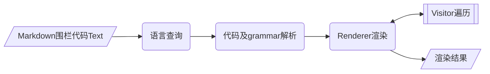

<div align="center">
<h1>prism</h1>
</div>

<p align="center">


</p>

## 介绍

prism 对代码内容进行标记和设置颜色。

### 特性

- 支持不同语言的代码标记和设置颜色

### 架构



### 源码目录

```shell
├── har
└── src
    └── main                 
        ├── cangjie
        ├── ets
        └── resources
```

- `har` har包目录
- `src main cangjie` 仓颉源码目录
- `src main ets` ets源码目录
- `src main resources` 资源目录

### 接口说明

主要是核心类和成员函数说明,详情如下

```ets
/**
 * 通过代码内容和代码类型和深浅色模式设置不同标记颜色
 *
 * @param code 代码内容
 * @param info 代码类型
 * @param isDarkula 是否深色模式
 * @return Promise<PrismNodesParseResColorArkts> 返回代码颜色标记对象
 */
function codeStringToColorString(code: string, info: string | undefined, isDarkula: boolean): Promise<PrismNodesParseResColorArkts>

/**
 * 代码块颜色标记对象
 */
class PrismNodesParseResColorArkts {
    /**
     * 返回代码块背景色
     *
     * @return number 返回代码颜色标记对象
     */
    getBackground(): number

    /**
     * 返回代码文本默认颜色
     *
     * @return number 代码文本默认颜色
     */
    getDefaultFontColor(): number

    /**
     * 返回代码标记颜色列表
     *
     * @return Array<PrismNodesParseResArkts> 代码标记颜色列表
     */
    getListColor(): Array<PrismNodesParseResArkts>
}

/**
 * 单独代码颜色标记对象
 */
class PrismNodesParseResArkts {
    /**
     * 返回代码类型
     *
     * @return string 返回代码类型
     */
    getType(): string
    
    /**
     * 返回代码内容
     *
     * @return string 返回代码内容
     */
    getText(): string
    
    /**
     * 返回别名
     *
     * @return string | undefined 返回别名
     */
    getAlias(): string | undefined
    
    /**
     * 返回代码文本颜色
     *
     * @return number | undefined 返回代码文本颜色
     */
    getColor(): number | undefined
}
```

## 使用说明

### ohpm安装使用

```cmd
ohpm install @cangjie-tpc/prism
```

### 功能示例

#### java语言高亮显示

```ets
import { codeStringToColorString, PrismNodesParseResArkts, PrismNodesParseResColorArkts } from '@cangjie-tpc/prism';

@Entry
@Component
struct Index1 {
  @State message: string = 'public class FibonacciSequence {\n' +
    '    public static void main(String[] args) {\n' +
    '        int n = 10; // 要计算的斐波那契数列的项数\n' +
    '        \n' +
    '        System.out.println("斐波那契数列的前" + n + "项：");\n' +
    '        \n' +
    '        for (int i = 0; i < n; i++) {\n' +
    '            System.out.print(fibonacci(i) + " ");\n' +
    '        }\n' +
    '    }\n' +
    '    \n' +
    '    // 递归方法计算斐波那契数列的第n项\n' +
    '    public static int fibonacci(int n) {\n' +
    '        if (n <= 1) {\n' +
    '            return n;\n' +
    '        } else {\n' +
    '            return fibonacci(n-1) + fibonacci(n-2);\n' +
    '        }\n' +
    '    }\n' +
    '}';
  @State
  list: Array<PrismNodesParseResArkts> = undefined!
  @State
  txtBackground: number = undefined!
  @State
  defaultFontColor: number = undefined!

  async aboutToAppear(): Promise<void> {
    let a: PrismNodesParseResColorArkts = await codeStringToColorString(this.message, "java", true)
    this.txtBackground = a.getBackground()
    this.defaultFontColor = a.getDefaultFontColor()
    this.list = a.getListColor()
  }

  isColor(getColor: number | undefined): number {
    if (getColor == undefined) {
      return this.defaultFontColor
    } else {
      return getColor
    }
  }

  build() {
    Column() {
      Scroll() {
        Column() {
          Scroll() {
            Column() {
              Text() {
                ForEach(this.list, (item: PrismNodesParseResArkts, index: number) => {
                  Span(item.getText())
                    .fontColor(this.isColor(item.getColor()))
                })
              }
              .fontSize(14)
              .textAlign(TextAlign.Start)
            }
            .justifyContent(FlexAlign.Start)
            .alignItems(HorizontalAlign.Start)
            .padding(10)
          }
          .backgroundColor(this.txtBackground)
          .scrollBar(BarState.Off)
          .scrollable(ScrollDirection.Horizontal)
          .width(`100%`)
        }
        .justifyContent(FlexAlign.Start)
        .alignItems(HorizontalAlign.Start)
      }
      .width(`100%`)
      .scrollable(ScrollDirection.Vertical)
      .padding({
        left: 10,
        right: 10,
        top: 20,
        bottom: 20
      })
    }
    .width(`100%`)
    .height(`100%`)
    .backgroundColor(Color.White)
  }
}
```

#### 执行结果如下


## 约束与限制

只适用ohos环境

## 开源协议

本项目基于 [Apache License 2.0](https://gitcode.com/Cangjie-TPC/prism4cj/blob/develop/LICENSE) ，请自由的享受和参与开源。

## 参与贡献

欢迎给我们提交 PR，欢迎给我们提交 issue，欢迎参与任何形式的贡献。
